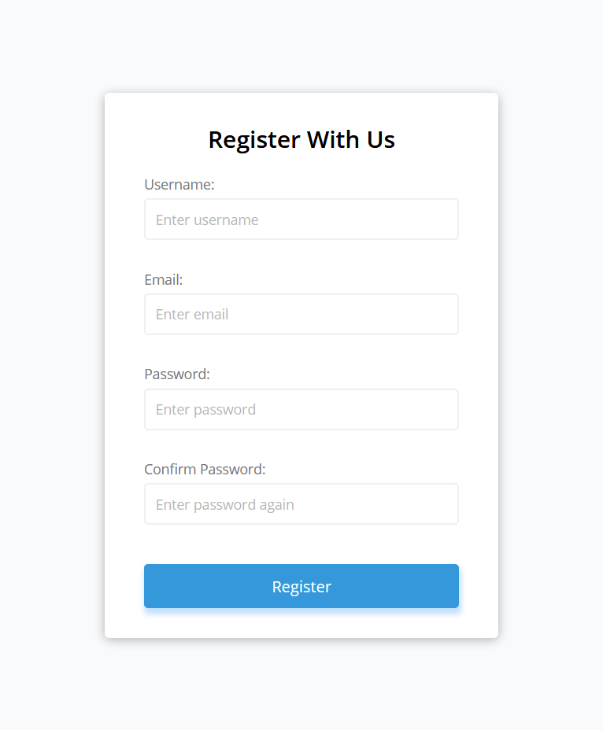
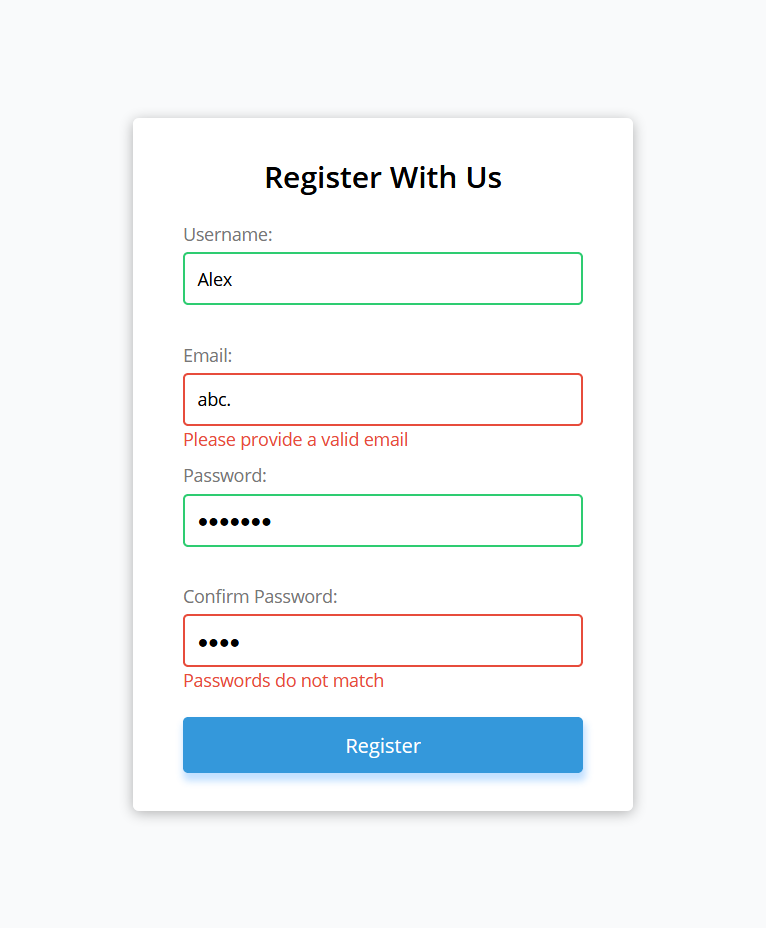

# HTML Form validation using vanilla JS

Simple client side form validation. Check required, length, email and password match

## Project Specifications

- Create form UI
- Show error messages under specific inputs

## Screenshots

1. ### Form Initial state

2. ### Form validation states

