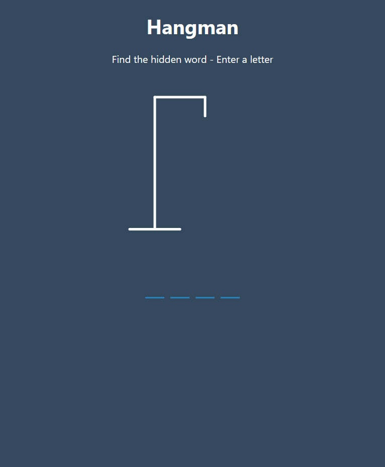
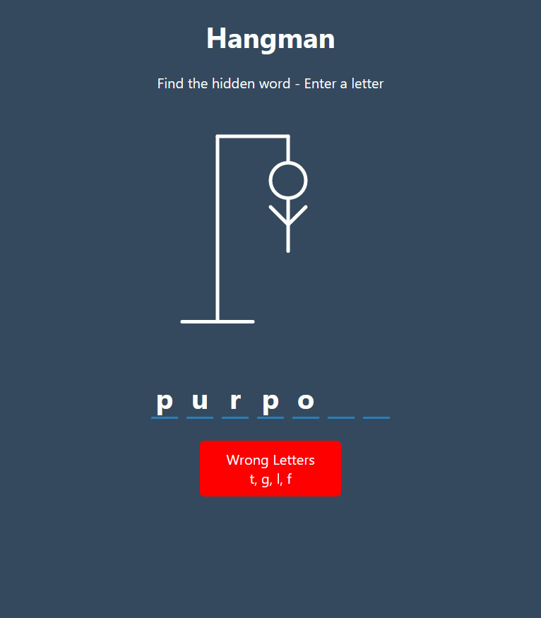
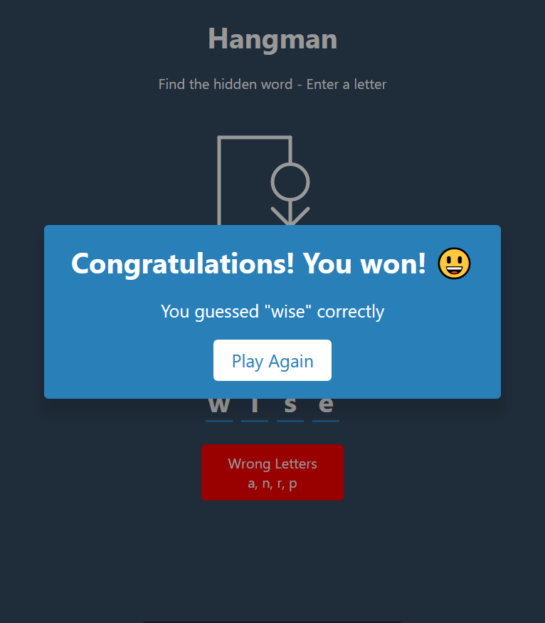
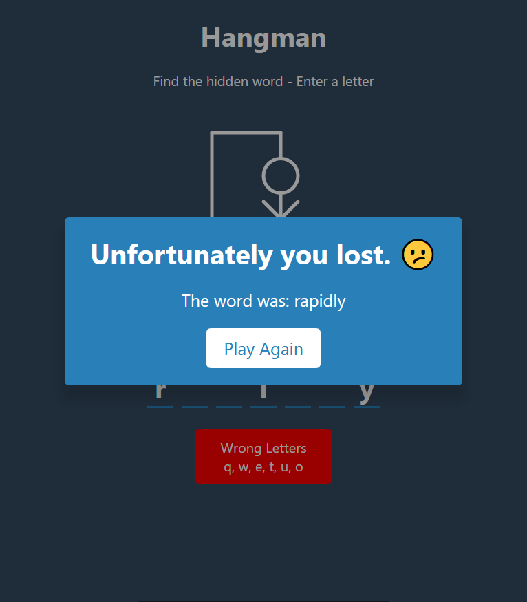

## Hangman Game

Select a letter to figure out a hidden word in a set amount of chances

## Project Specifications

- Display hangman pole and figure using SVG
- Generate a random word
- Display word in UI with correct letters
- Display wrong letters
- Show notification when select a letter twice
- Show popup on win or lose
- Play again button to reset game

## Concepts Used

1. **`keyboard events`** handling
2. Javascript **`Sets`**
3. **`DOM`** API

## Screenshots

1. Game Start

1. Game In Progress

1. Game Won

1. Game Lost

