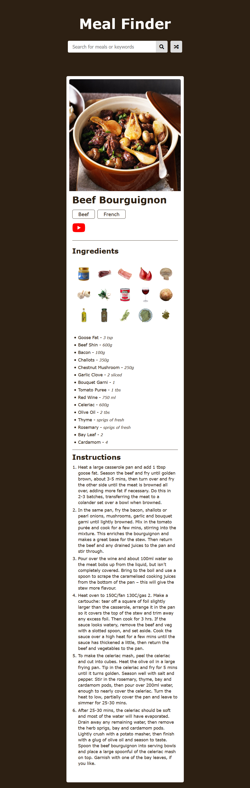

## Meal Finder App

Search and generate random meals from the [themealdb.com](https://www.themealdb.com) API

## Project Specifications

- Display UI with form to search and button to generate
- Connect to API and get meals
- Display meals in DOM with image and hover effect
- Click on meal and see the details
- Click on generate button and fetch & display a random meal

## Screenshots

1. ## List of Meals

2. ## Meal Details

