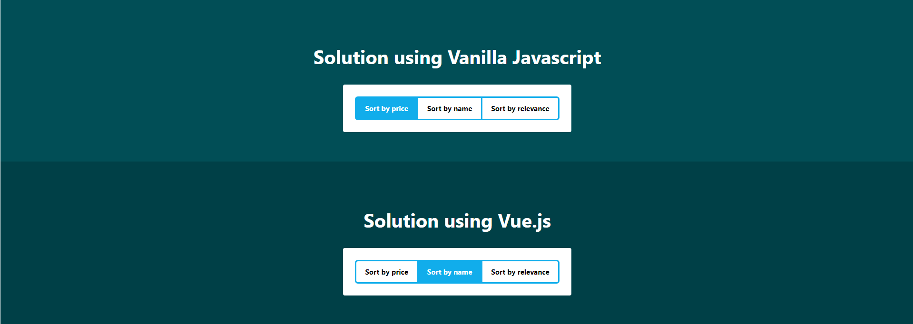
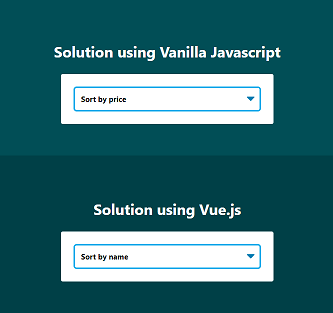

# Segmented Control

## On Desktop viewport

We display a **Segmented Control**, where a set of options are displayed side by side. The selected option is highlighted using background color.

## On Mobile viewport'

We display HTML5 **`<select>`** control.

The state of **Segmented control** and **`<select>`** are synced with each other. Thus if user changes viewport width, the corresponding control displays option in sync with other control.